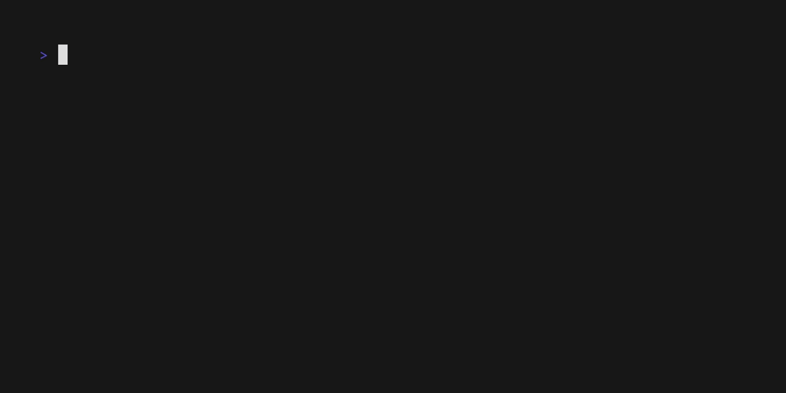

# Hyper Console

Hyper Console is a terminal user interface (TUI) application for supporting the development of HyperShift applications. It provides a set of tools for managing HyperShift related tasks, clusters, examples, and more.

## Used Libraries & Tools

- [Bubble Tea](https://github.com/charmbracelet/bubbletea)
- [Taskfile](https://taskfile.dev)
- [Mage](https://magefile.org)

